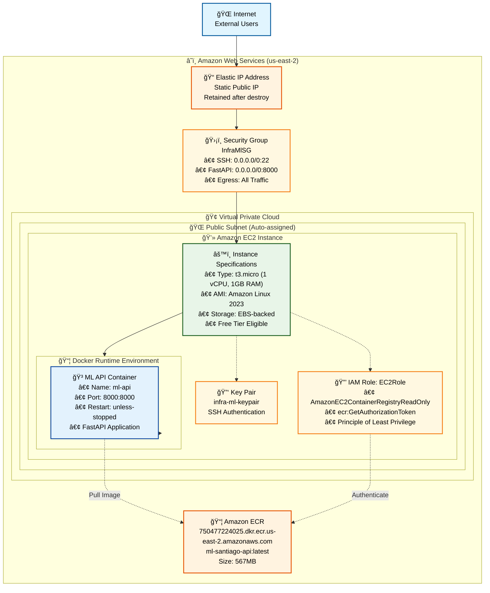
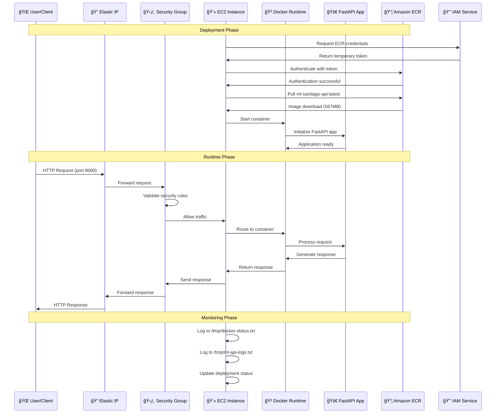

# Diagrama de Arquitectura AWS - Infraestructura ML

## Arquitectura Completa del Sistema

```mermaid
graph TB
    %% Styling
    classDef internetClass fill:#e1f5fe,stroke:#01579b,stroke-width:2px,color:#000
    classDef awsServiceClass fill:#fff3e0,stroke:#e65100,stroke-width:2px,color:#000
    classDef networkClass fill:#f3e5f5,stroke:#4a148c,stroke-width:2px,color:#000
    classDef computeClass fill:#e8f5e8,stroke:#1b5e20,stroke-width:2px,color:#000
    classDef containerClass fill:#e3f2fd,stroke:#0d47a1,stroke-width:2px,color:#000
    classDef securityClass fill:#fff8e1,stroke:#f57f17,stroke-width:2px,color:#000
    
    %% External Layer
    INTERNET[🌠Internet<br/>External Users]:::internetClass
    
    %% AWS Cloud Infrastructure
    subgraph AWS["â˜ï¸ Amazon Web Services (us-east-2)"]
        direction TB
        
        %% Elastic IP
        EIP[📠Elastic IP Address<br/>Static Public IP<br/>Retained after destroy]:::awsServiceClass
        
        %% Security Layer
        SG[ğŸ›¡ï¸ Security Group<br/>InfraMlSG<br/>• SSH: 0.0.0.0/0:22<br/>• FastAPI: 0.0.0.0/0:8000<br/>• Egress: All Traffic]:::securityClass
        
        %% VPC Network
        subgraph VPC["🢠Virtual Private Cloud"]
            direction TB
            
            %% Public Subnet
            subgraph SUBNET["🌠Public Subnet (Auto-assigned)"]
                direction TB
                
                %% EC2 Instance
                subgraph EC2["💻 Amazon EC2 Instance"]
                    direction TB
                    EC2_SPECS["âš™ï¸ Instance Specifications<br/>• Type: t3.micro (1 vCPU, 1GB RAM)<br/>• AMI: Amazon Linux 2023<br/>• Storage: EBS-backed<br/>• Free Tier Eligible"]:::computeClass
                    
                    %% IAM Role
                    IAM_ROLE["🔒 IAM Role: EC2Role<br/>• AmazonEC2ContainerRegistryReadOnly<br/>• ecr:GetAuthorizationToken<br/>• Principle of Least Privilege"]:::securityClass
                    
                    %% Key Pair
                    KEYPAIR["🔑 Key Pair<br/>infra-ml-keypair<br/>SSH Authentication"]:::securityClass
                    
                    %% Docker Container
                    subgraph DOCKER["📦 Docker Runtime Environment"]
                        direction TB
                        CONTAINER["🳠ML API Container<br/>• Name: ml-api<br/>• Port: 8000:8000<br/>• Restart: unless-stopped<br/>• FastAPI Application"]:::containerClass
                    end
                end
            end
        end
        
        %% ECR Repository
        ECR["📦 Amazon ECR<br/>750477224025.dkr.ecr.us-east-2.amazonaws.com<br/>ml-santiago-api:latest<br/>Size: 567MB"]:::awsServiceClass
    end
    
    %% Connections
    INTERNET --> EIP
    EIP --> SG
    SG --> EC2_SPECS
    EC2_SPECS -.-> IAM_ROLE
    EC2_SPECS -.-> KEYPAIR
    EC2_SPECS --> DOCKER
    DOCKER --> CONTAINER
    CONTAINER -.->|Pull Image| ECR
    IAM_ROLE -.->|Authenticate| ECR
```

## Flujo de Datos y Comunicación

```mermaid
sequenceDiagram
    participant U as 🌠User/Client
    participant EIP as 📠Elastic IP
    participant SG as ğŸ›¡ï¸ Security Group
    participant EC2 as 💻 EC2 Instance
    participant Docker as 🳠Docker Runtime
    participant API as 🚀 FastAPI App
    participant ECR as 📦 Amazon ECR
    participant IAM as 🔒 IAM Service
    
    Note over U,ECR: Deployment Phase
    EC2->>IAM: Request ECR credentials
    IAM->>EC2: Return temporary token
    EC2->>ECR: Authenticate with token
    ECR->>EC2: Authentication successful
    EC2->>ECR: Pull ml-santiago-api:latest
    ECR->>EC2: Image download (567MB)
    EC2->>Docker: Start container
    Docker->>API: Initialize FastAPI app
    API->>Docker: Application ready
    
    Note over U,ECR: Runtime Phase
    U->>EIP: HTTP Request (port 8000)
    EIP->>SG: Forward request
    SG->>SG: Validate security rules
    SG->>EC2: Allow traffic
    EC2->>Docker: Route to container
    Docker->>API: Process request
    API->>Docker: Generate response
    Docker->>EC2: Return response
    EC2->>SG: Send response
    SG->>EIP: Forward response
    EIP->>U: HTTP Response
    
    Note over U,ECR: Monitoring Phase
    EC2->>EC2: Log to /tmp/docker-status.txt
    EC2->>EC2: Log to /tmp/ml-api-logs.txt
    EC2->>EC2: Update deployment status
```

---

